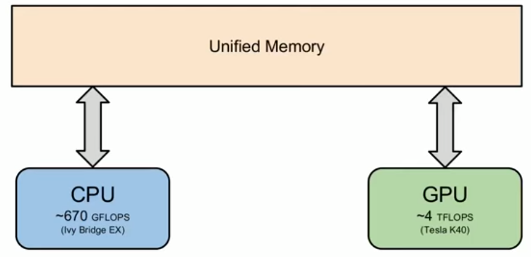
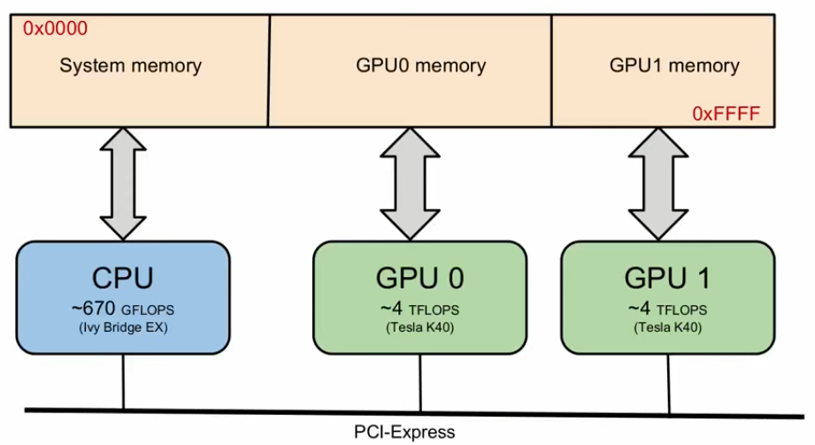
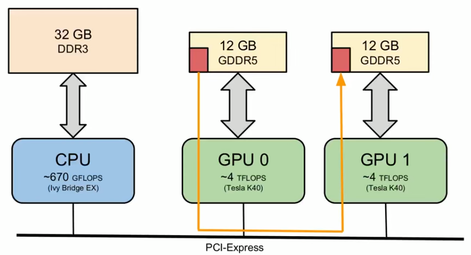
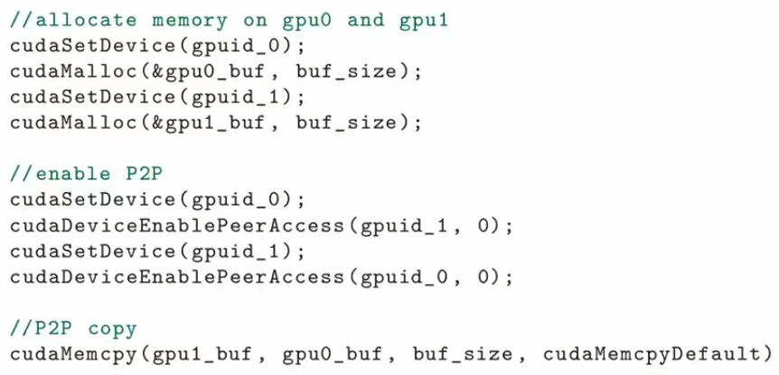
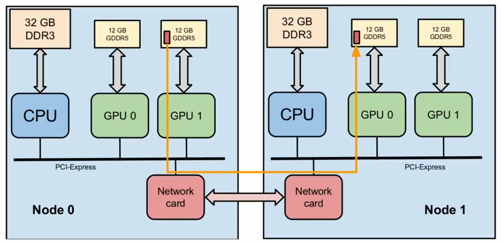
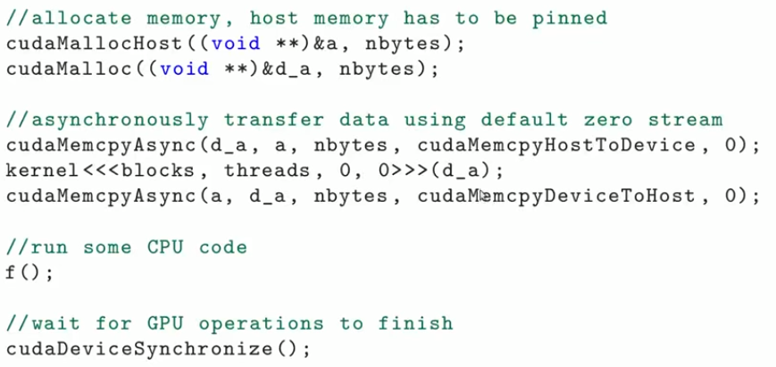

# GPU-Communication-Optimization

## PCI (Peripheral Component Interconnect) Express

Computer expansion bus. Provides point to point connection. For example, for PCI-e v2:

- Single Lane (x1)
  - 500 MB/s
- Multiple Lanes (x2, x4, x8, x16, x32)
  - For example, 8 GB/s for a 16 lane bus.

## Memory Types 
### Pageable Memory

In pageable memory, pages may be swept to disk. When device requests the memory, you need to copy it to kernel memory space (the yellow one), then transfer it to gpu memory.

### Pinned Memory
Pinned memory is allocated witn the kernel memory space and kernel memory space is already page locked (cannot be swept to disk). 

* Do not overallocate pinned memory (Seems like it reduces amount of physical memory available for OS).  

### Implementation of both memory types

### Unified Virtual Memory (UVM)

Developer views the memory as one contiguous block (As a matter fact, there are two distinct memories, i.e. host memory and device memory)

- Simplifies development
- Performance may not be very good (since it may divide memory transfer to chunks).
- Performance is even worse for multithreaded applications.

## GPU Direct and Unified Virtual Addressing

### Unified Virtual Adressing
UVA maps memories into single address space.

### Peer to Peer Transfers
Allows copying directly from one GPU to another.

Peer to peer implementation:

### GPU Direct Remote Direct Memory Access (RDMA)

Without GPU Direct RDMA, 

1. Data from a GPU memory in Node 0 would be first transferred to CPU memory of Node 0.
2. Then, to driver memory of network card in Node 0.
3. Then, to driver memory of network card in Node 1.
4. Then, to CPU memory of Node 1
5. Then, to GPU memory of Node 1.

With GPU Direct RDMA,

1. Data from a GPU memory in Node 0 would be directly transferred to driver memory of network card in Node 0.
2. Then, to driver memory of network card in Node 1.
3. Then, to GPU memory in Node 1.

## Asynchronous Data Transfers

* cudaMemcpy is blocking.
* cudaMemcpyAsync is non-blocking (good time utilizing CPU)
* cudaMemcpyAsync has two requirements:
  * Pinned memory
  * Stream id

## Takeaways

* PCI-E is efficient only starting from reasonably large data buffer.
* UVM simplifies programming but may result in worse performance.
* Follow the data path and avoid unnecessary copies (pinned memory, GPUDirect)
* Compute something while data is being transferred.