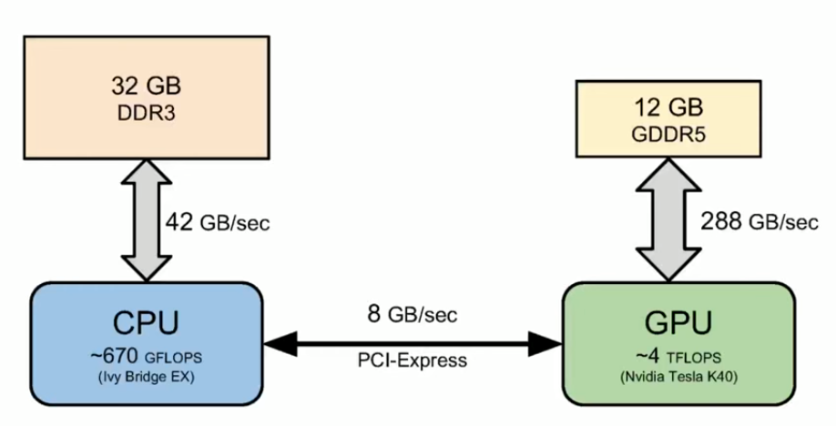
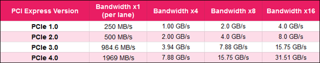
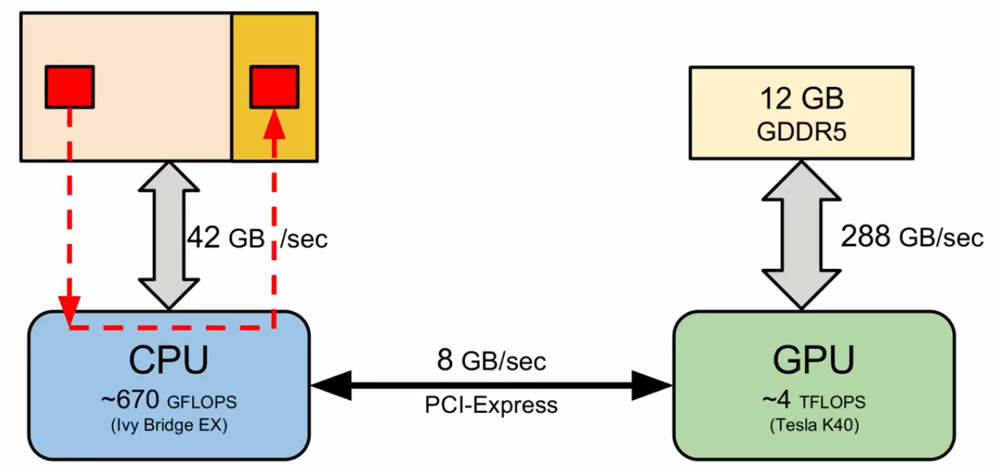
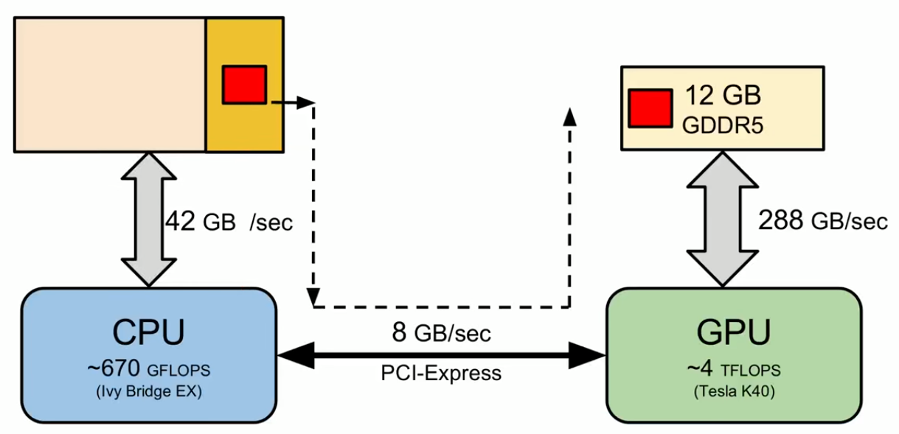
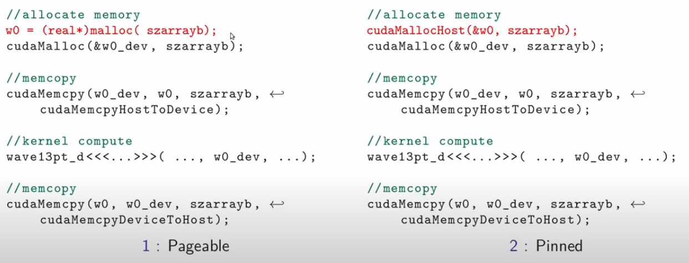

# GPU-Communication-Optimization

## PCI Express

Computer expansion bus. Provides point to point connection. For PCI-e v2:

- Single Lane (x1)
  - 500 MB/s
- Multiple Lanes (x2, x4, x8, x16, x32)
  - For example, 8 GB/s for a 16 lane bus.

## Memory Types 
### Pageable Memory

In pageable memory, pages may be swept to disk. When device requests the memory, you need to copy it to kernel memory space (the yellow one), then transfer it to gpu memory.

### Pinned Memory
Pinned memory is allocated witn the kernel memory space and kernel memory space is already page locked (cannot be swept to disk). 

* Do not overallocate pinned memory (Seems like it reduces amount of physical memory available for OS).  

### Implementation of both memory types

